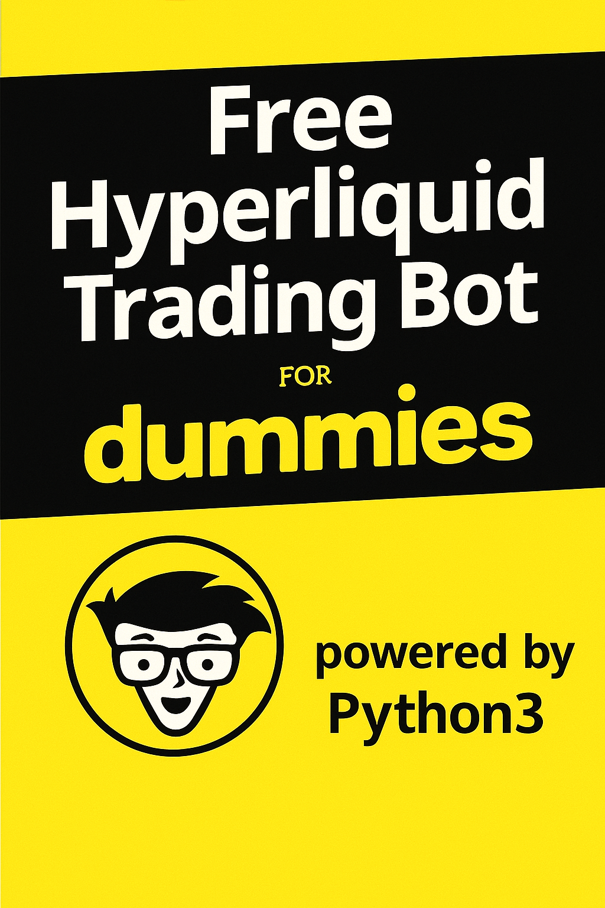

# Free Hyperliquid Python3 Trading Bot 4 PAXG + Panel

A real-time monitoring and trading panel for PAXG (Paxos Gold) using the RSI 1MIN Double Confirm strategy on Hyperliquid.



## 🎁 Get Started with Bonus

**Sign up using our referral link to get a 4% fee discount bonus:**
👉 [Join Hyperliquid with BONUS500](https://app.hyperliquid.xyz/join/BONUS500)

After signing up, get your API keys from: [Hyperliquid API Settings](https://app.hyperliquid.xyz/API)


## Overview

This bot implements a SHORT-based trading strategy using RSI (Relative Strength Index) with a double confirmation mechanism:
- **SHORT Signal**: RSI tops above 65, then dips below 50 while price breaks support
- **COVER Signal**: RSI reaches oversold levels (< 20)
- **Risk Management**: Automatic take profit (1.5%) and stop loss (-0.7%)

## Features

- 🎯 **Real-time Monitoring**: Live account balance, positions, and RSI tracking
- 🤖 **Automated Trading**: Set-and-forget bot with configurable parameters
- 📊 **Multi-Tab Interface**: Main dashboard, bot control, and trade history
- 🔒 **Risk Management**: Built-in take profit and stop loss protection
- 🌐 **Testnet Support**: Test strategies safely before going live

## Installation

### Prerequisites

- Python 3.8 or higher
- Linux/Mac (for curses terminal UI)
- Hyperliquid account with API access

### Setup

1. Clone the repository:
```bash
git clone https://github.com/aiwebarchitects/hyperliquid_free_trading_bot.git
cd hyperliquid_free_trading_bot
```

2. Install dependencies:
```bash
pip install -r requirements.txt
```

3. Configure API credentials:
Open `executer/config.json` and replace the placeholder values with your Hyperliquid API credentials:
```json
{
  "account_address": "your_wallet_address",
  "secret_key": "your_private_key"
}
```

**For Mainnet:**
Get your API credentials from [Hyperliquid API Settings](https://app.hyperliquid.xyz/API)

**For Testnet:**
- First, claim 1000 USDC test funds: [Testnet Faucet](https://app.hyperliquid-testnet.xyz/drip)
- Then create your testnet API key: [Testnet API Settings](https://app.hyperliquid-testnet.xyz/API)
- Remember to set `BOT_USE_TESTNET = True` in `settings.py`

4. Configure bot settings:
Edit `settings.py` to customize:
- `BOT_USE_TESTNET`: Set to `True` for testnet, `False` for mainnet
- `BOT_POSITION_VALUE_USD`: Position size per trade
- `BOT_MAX_TOTAL_POSITION_USD`: Maximum total position value
- `BOT_BUY_COOLDOWN_MINUTES`: Cooldown between trades

## Usage

### Start the Panel

```bash
python3 paxg_panel.py
```

### Keyboard Controls

- **TAB** or **←/→**: Switch between tabs (Main, Bot, History)
- **S**: Start the automated trading bot
- **X**: Stop the automated trading bot
- **R**: Refresh data manually
- **Q**: Quit the application

### Tabs

1. **MAIN**: Account overview, current position, and RSI indicator
2. **BOT**: Bot control, activity logs, and current signals
3. **HISTORY**: Last 20 PAXG trades

## Trading Strategy

### RSI 1MIN Double Confirm (SHORT-based)

The bot uses a sophisticated double confirmation mechanism:

1. **Setup Phase**: RSI must first "top" by either:
   - Reaching overbought (> 65), OR
   - Making a local peak above 60

2. **SHORT Signal** (all conditions must be met):
   - RSI has topped (from step 1)
   - RSI crosses below 50
   - Price breaks below support level (lowest low in last 10 candles)

3. **COVER Signal**:
   - RSI crosses into oversold territory (< 20)

4. **Risk Management** (checked every cycle):
   - Take Profit: Close at +1.5% profit
   - Stop Loss: Close at -0.7% loss

### Optimized Parameters

The bot uses the following optimized parameters:
- RSI Period: 10
- Oversold Threshold: 20
- Overbought Threshold: 65
- Take Profit: 1.5%
- Stop Loss: -0.7%

## Configuration

### settings.py

```python
# Network Configuration
BOT_USE_TESTNET = True  # Set to False for mainnet

# Trading Configuration
BOT_POSITION_VALUE_USD = 100.0  # Position size per trade
BOT_MAX_TOTAL_POSITION_USD = 500.0  # Maximum total position
BOT_BUY_COOLDOWN_MINUTES = 5  # Cooldown between trades
```

## Safety Features

- ✅ Testnet mode for safe testing
- ✅ Position size limits
- ✅ Trade cooldown periods
- ✅ Automatic stop loss
- ✅ Manual bot control (start/stop anytime)

## File Structure

```
hyperliquid_free_trading_bot/
├── paxg_panel.py                    # Main application
├── settings.py                      # Bot configuration
├── README.md                        # This file
├── requirements.txt                 # Python dependencies
├── system_files.txt                 # System documentation
├── free_hyperliquid_trading_bot.png # Bot screenshot
└── executer/
    ├── example_utils.py             # Exchange utilities
    └── config.json                  # API credentials
```

## Troubleshooting

### Terminal Size Error
If you see "Terminal too small!", resize your terminal to at least 60x20 characters.

### Connection Issues
- Verify your API credentials in `executer/config.json`
- Check if you're using the correct network (testnet vs mainnet)
- Ensure you have internet connectivity

### No RSI Data
- The bot fetches data from Binance API for RSI calculation
- Check your internet connection
- Wait a few seconds for initial data load

## Disclaimer

⚠️ **IMPORTANT**: This bot is for educational purposes only. Trading cryptocurrencies involves substantial risk of loss. Always:
- Test thoroughly on testnet first
- Start with small position sizes
- Never invest more than you can afford to lose
- Monitor the bot regularly
- Understand the strategy before using it

## License

This project is provided as-is without any warranty. Use at your own risk.

## Support

For issues or questions, please check the system_files.txt for technical details or review the code documentation.
